# RO54 - TD1 - N-Lateration

> This report is made by **RASSIÉ Nathan** and **DERAISIN Nicolas**.
> 
> It has been written in **Markdown**.
> 
> 3D graph has been generated using **GeoGebra**.
> 
> Class Diagram has been created with **Mermaid**.
> 
> Implementation has been done in **Swift programming language**. Go to *Appendix 1* at the end of the report to get ressources about installing swift.

---

## Concept and example of an N-Lateration problem

N-Lateration is a method used to geolocalize someone (or more precisely <u>something</u>, like a numerical device acting as a **signal emitter**). It is based on the process of determining the **unknown position of this device** using **known positions of multiple receivers** (or anchors) and their distance to the emitter.

#### Basic example - Position of an indoor robot

> Let's say a computer vision laboratory is working on a fully automated robot, capable of moving across the facility from one room to another, taking corridors, crossing doors etc...

To move itself precisely without colliding any wall or person, <u>the robot has to be geolocalized.</u>

Wifi repeaters are installed all across the facilities to efficiently propagate the network for all the users, as we're in 2023 and all need a stable access to the internet.

We know the position of wifi repeaters and want to process the position of the robot.
Hence we will use wifi repeaters as receivers, use the known distance between the robot (emitter, querying all nearby wifi repeaters) and the receivers by processing the time-response of the signal, then compute the equations of position and find the robot position. 

## Solving of a N-Lateration problem

> **Theorem :** Solving the N-Lateration problem in a N-dimensional space requires N+1 geometrical distances.

Summing up our example, we have :

- Known informations :
  
  - Position of receivers
  
  - Time of flight of a query (Emitting / Receiving)
  
  - Distance between the emitter and each receiver

- To-find information :
  
  - Position of emitter

#### Theoretical solving

In a three-dimensional space, let's call $d_i, \forall{i} > 3$ each distance between the emitter and each receiver. Let $(x_i,y_i,z_i)$ the coordinates of each receiver, and $(x,y,z)$ the coordinates of the emitter.

Then :

$$
d_i = \sqrt{(x-x_i)^2 + (y-y_i)^2 + (z-z_i)^2}
$$

Solving this equation system to find the intersection point will provide the localisation of the emitter, assuming the distances <u>are not</u> colinear. 

> Note : Multiple solving methods and algorithms exists. In computer use-case, choosing one depends on the balance between speed and precision.

#### Graphical solving

Taking what has been said just above, there is an issue with the practical application of the theory. In real world, the intersection may not exist, because of an error on the measurement. 

Using a graphical approch, we can consider each receivers as a sphere in a three-dimensionnal world, with their position as the center of the sphere and the distance to the Emitter as the radius.

| Real Life                   | Model              |
|:---------------------------:|:------------------:|
| Position of a receiver      | Center of a sphere |
| Distance receiver - emitter | Radius of a sphere |

That being said, in order to solve the problem we need to find the closest point to the theoretical intersection of all sphere.

Let's take the datas given for the current application.

| Receivers | Position        | Distance to  the Emitter |
|:---------:|:---------------:|:------------------------:|
| R1        | (0.5, 0.5, 0.5) | 3                        |
| R2        | (4, 0, 0)       | 2                        |
| R3        | (4, 5, 5)       | 4.2                      |
| R4        | (3, 3, 3)       | 2.5                      |

Using **GeoGebra** website, we can draw a 3D representation of the datas and visualize approximately the position of our Emitter. We can also notice that all spheres does not intersect, as described by the measurement error of real life application.


Summing up what was explained above with a clear 2D representation, we got :


## Algorithm

In computer science, solving this problem by taking the measurement error into account results in the implementation of a **minimization algorithm**. Here, we want to <u>minimize the sum of all distances to the emitter</u>.

We can do it iteratively, but first we have to reduce the searching area. This is possible by defining a **minimum** and a **maximum** position, using thoses of the receivers. Again, let $(x_i,y_i,z_i)$ the coordinates of each receiver. Then :

$$
minPositionX \leqslant x_i \leqslant maxPositionX \\
minPositionY \leqslant z_i \leqslant maxPositionY \\
minPositionZ \leqslant x_i \leqslant maxPositionZ
$$

Eventually, we will be able to process the sum of distances for each point in the reduce area (by defining an iterative step), then substract the known **radius ($r_i$)** of each Receiver and find the position of the Emitter.

$$
emitterPosition = min(\sum_{i = minPos,step}^{maxPos}d_i-r_i)
$$

## Implementation

#### Program architecture

To implement this application, an object-oriented approach fits, as we have differents types of objects with their own properties being compute together. To structure our code, we made a class diagram using **Mermaid** generator.



Typically, we have mutliple **Devices**, such as an **Emitter** and a **Receiver**. They have coordinates in a 3D world, an identifier and possibly a name. When calling the **N-Lateration** class, filling it with the Emitter to localize and the list of Receivers, we can then call the *nLaterationSolver* function to solve the Emitter's position.

## Results

#### Analytical

To make the analytical resolution, we used Geogebra3D to estimate position. We look for the intersection of most receivers (the red line) to place a point. Then, we will try to find the most accurate position on this line which is the closest to the last sphere that is not part of the intersection.


We obtain the H point, a result close to the computational analysis (see below).


#### Computational

Using **Swift 5**, a recent and convenient programming language, implementing the solver function gives us the following code :

```swift
    /// Try to solve position of the emitter by minimizing
    /// the sum of distances to all Receivers. Return an optional
    /// with x, y, z coordinates if the operation succeed, nil otherwise.
    mutating func solveEmitterPosition(withStep step: Float = 0.1) -> [Float]? {

        // Ensure there is four or more receivers in the dictionnary to be able to solve the emitter position
        guard getReceiverCount() >= 4 else { return nil }

        // Reduce area of research
        computeResearchArea()

        // Process each sum of distances in the searching area to find the lowest one
        // Initializing default value of min distance by using a random receiver's distance
        var minDistance: Float = 0.0
        for (_, receiver) in receivers { minDistance += receiver.distance } // Initialize defaut minimum distance value
        var emitterPosition: [Float]?

        for x in stride(from: minAreaPoint[0], to: maxAreaPoint[0], by: step) {
            for y in stride(from: minAreaPoint[1], to: maxAreaPoint[1], by: step) {
                for z in stride(from: minAreaPoint[2], to: maxAreaPoint[2], by: step) {

                    // Process and sum distances to all Receivers
                    var distance: Float = 0.0

                    for (_, receiver) in receivers {
                        distance += abs(sqrtf(pow(x - receiver.x!,2) + pow(y - receiver.y!,2) + pow(z - receiver.z!,2)) - receiver.distance)
                    }

                    // Keep the lowest distance
                    if distance < minDistance {
                        minDistance = distance
                        emitterPosition = [x, y, z]
                    }

                }
            }
        }

        return emitterPosition
    }
```


As above, the returned position of the Emitter with our demo datas is right.

> Note that using an iterative algorithm may be really slow with more datas. Other approaches exists, such as **Gradient descent**, which try to find global minimum of a function using **partial derivatives**.

---

## Appendix 1 - Installing Swift

Swift is the main language of Apple devices since almost ten years. It is developed both by Apple and the open-source community. It has been port on Linux and recently on Windows. Though, you can install **Swift Toolchain** on Linux / Windows following the official tutorials, or using XCode IDE if you are on macOS.

- [Swift.org - Download Swift](https://www.swift.org/download/)

When it is done, ensure Swift is ready by running the following command in your shell :

```bash
> swift --version
```

Then, go the folder containing the **Package.swift** file, provided with our N-Lateration project archive, and run :

```bash
> swift build
> swift run
```

You should have the following result print in your shell :


